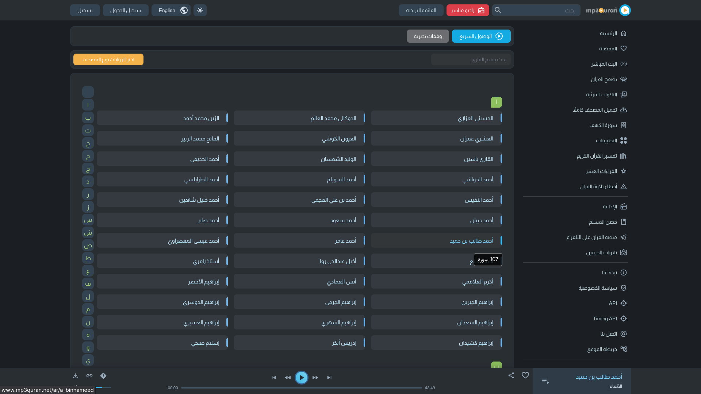
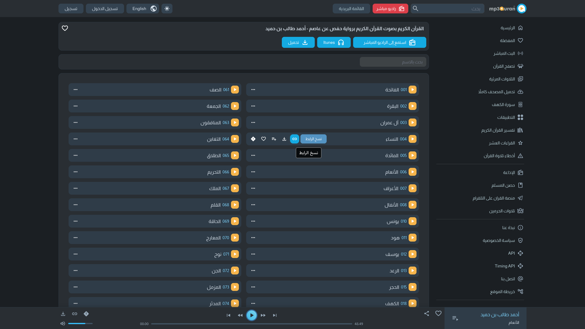

<div align="center">

# Quran Downloader

Bash script to download all 114 surahs as MP3 from [mp3quran.net](https://mp3quran.net).

</div>

## How it works

1. You give it a URL of any surah from [mp3quran.net](https://mp3quran.net)
2. It extracts the sheikh name and base URL automatically
3. Creates a folder named after the sheikh
4. Downloads surahs `001.mp3` through `114.mp3` into that folder
5. Skips already downloaded files (safe to re-run)

## Prerequisites

- `bash`
- `wget`

## Usage

```bash
chmod +x quran-downloader.sh
./quran-downloader.sh '<url>'
```

## How to find the URL

### Step 1 — Go to [mp3quran.net](https://mp3quran.net)

### Step 2 — Pick a sheikh

Browse the home page and click on the sheikh/recitation you want.



### Step 3 — Open any surah page

Click on any surah from the list.

### Step 4 — Copy the MP3 link

Click the **نسخ الرابط** (Copy link) button on any surah.



The URL will look like:

```
https://server16.mp3quran.net/afasy/Murattal-Hafs/001.mp3
                                        ^^^^^^^^^^^^^^^^^^^
                                        This part does not matter
```

Only the **sheikh name** (e.g. `afasy`) is used — the script ignores the surah number and downloads all 114.

### Step 5 — Run the script

```bash
./quran-downloader.sh 'https://server8.mp3quran.net/afs/001.mp3'
```

This creates an `afasy/` folder with all 114 surahs.

## Example

```bash
# Download Mishary Alafasy's Murattal
./quran-downloader.sh 'https://server8.mp3quran.net/afs/001.mp3'
```
